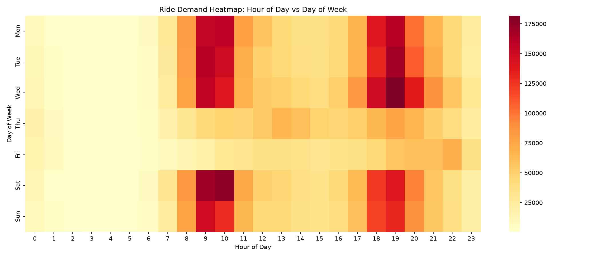
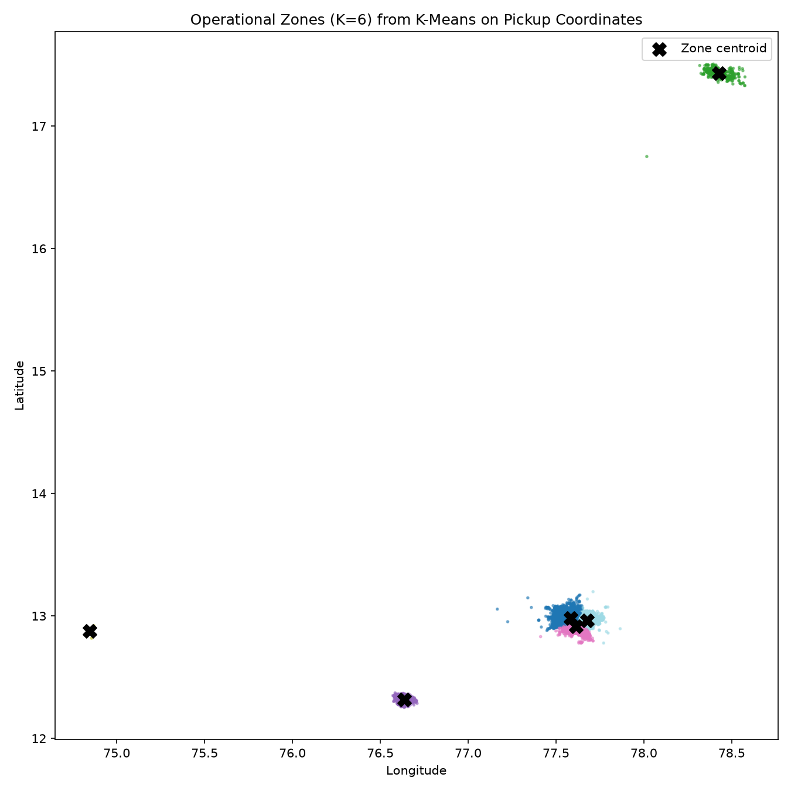
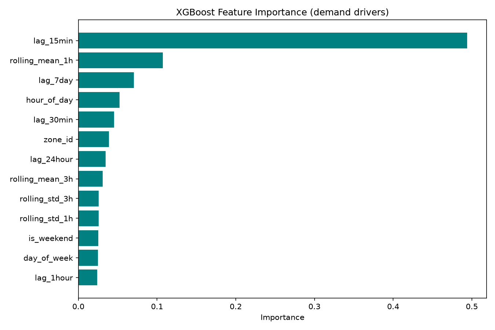

# RideQuest — Ola Bike Ride Demand Forecast

An end-to-end machine learning pipeline that predicts ride-request demand for Ola's bike-sharing service, broken down by geographic zone and 15-minute time window. Built to help ride-sharing platforms proactively reposition drivers ahead of demand spikes, instead of reacting after riders are already waiting.

**Pipeline:** raw ride logs → cleaning & EDA → K-Means zone clustering & time-series features → model benchmarking → business case.

Also ships as an **interactive Streamlit dashboard** — see below.

---

## Results at a glance



Clear morning (9–10am) and evening (6–8pm) demand peaks, consistent across weekdays and weekends.



Pickup locations clustered into 6 operational zones via K-Means (silhouette-selected K). Two of these zones are small outlier pockets outside the main metro area — a real, flagged limitation, not swept under the rug (see [Caveats](#honest-caveats-from-this-build) below).



The most recent 15-minute demand (`lag_15min`) dominates as a predictor — short-horizon demand is highly momentum-driven.

---

## Key findings

- **Cleaning:** 8,381,556 raw rows → 8,227,844 after removing duplicates, out-of-bounds coordinates, and near-zero-distance (fraud) trips.
- **Clustering:** K=6 zones selected by silhouette score.
- **Best model by RMSE:** Ridge Regression narrowly beat LightGBM and XGBoost on the `demand_next_15min` target — a legitimate result given how dominant the most recent lag is as a predictor at this short horizon.
- **Feature importance:** `lag_15min` > `rolling_mean_1h` > `lag_30min` — recent momentum matters far more than day-of-week/hour features for near-term forecasting.

Full write-up with business impact, ROI framing, and MLOps architecture: [`Phase4_business_writeup.md`](Phase4_business_writeup.md).

---

## Repo structure

```
├── notebook.ipynb                       <- exploratory notebook version of the pipeline
├── phase1_cleaning_eda.py               <- data cleaning, feature extraction, EDA plots
├── phase2_clustering_features.py        <- K-Means zone clustering, lag/rolling features
├── phase3_model_benchmark.py            <- model comparison (Naive, Ridge, XGBoost, LightGBM)
├── Phase4_business_writeup.md           <- business case & MLOps architecture
├── streamlit_app.py                     <- interactive dashboard for all 4 phases
├── requirements.txt
├── phase1_*.png, phase2_*.png, phase3_*.png   <- generated result visuals
└── README.md
```

---

## Setup

```bash
python -m venv venv
source venv/bin/activate        # venv\Scripts\activate on Windows
pip install -r requirements.txt
```

## Run order

Each phase's output feeds the next phase's input — run in order:

```bash
# 1. Clean raw data, extract time features, generate EDA plots
python phase1_cleaning_eda.py
# -> phase1_cleaned_features.csv, phase1_heatmap_hour_vs_day.png,
#    phase1_hourly_trend.png, phase1_spatial_peak_scatter.png

# 2. K-Means zone clustering + zone x time lag/rolling features
python phase2_clustering_features.py
# -> phase2_zone_timeseries.csv, phase2_elbow_silhouette.png, phase2_zone_map.png

# 3. Model benchmark with TimeSeriesSplit CV and a custom under-prediction penalty metric
python phase3_model_benchmark.py
# -> phase3_model_comparison_summary.csv, phase3_model_comparison_by_fold.csv,
#    phase3_feature_importance.png, phase3_predictions_vs_actual.png
```

`Phase4_business_writeup.md` is a written document, not a script — open it directly.

Each script writes outputs to the current working directory. Either run them from the repo root (simplest), or edit the `INPUT_PATH` / `OUTPUT_*` constants near the top of each file to point at your own folder layout.

---

## Streamlit dashboard

`streamlit_app.py` wraps all 4 phases into one interactive app instead of running each script separately — it reads the CSV/PNG outputs already produced above rather than recomputing the pipeline live.

```bash
streamlit run streamlit_app.py
```

Opens at `http://localhost:8501`. Use the sidebar to switch between phases.

Two things to know:
- **Phase 1's file is large** (8.2M+ rows once decompressed). The app loads a random sample (default 300,000 rows, adjustable in the sidebar) instead of the full file, to keep memory usage manageable. Bump the cap up if your machine has plenty of RAM.
- The CSV/markdown files the dashboard reads (`phase1_cleaned_features.csv[.gz]`, `phase2_zone_timeseries.csv`, `phase3_model_comparison_summary.csv`, `phase3_model_comparison_by_fold.csv`, `Phase4_business_writeup.md`) need to sit in the same folder as `streamlit_app.py`, or edit the path constants near the top of the file.

---

## Honest caveats from this build

- Two of the six K-Means zones are small outlier pockets far outside the main metro area (visible in `phase2_zone_map.png`) rather than genuine operational zones — worth excluding or re-clustering on the primary metro area only before this goes further.
- Ridge Regression outperformed XGBoost/LightGBM on this target/horizon. Not a bug — with lag/rolling features this strong, the extra non-linear capacity of tree ensembles didn't add value here. Worth re-testing on `demand_next_1hour` (already computed as a target column in Phase 2's output — just swap the `TARGET` constant in Phase 3) where non-linear interactions are more likely to matter.
- The raw dataset has no `request_id`, `driver_id`, or `status` field, so "true demand" can't be split from "fulfilled demand" — every row is treated as a demand signal. See the docstring in `phase1_cleaning_eda.py`.
- Prophet/Auto-ARIMA were scoped out of the automated Phase 3 benchmark since they fit one model per zone rather than one panel model for all zones — a stub function (`fit_prophet_per_zone`) is included at the bottom of `phase3_model_benchmark.py` for anyone who wants to extend it.
- SHAP is listed in `requirements.txt` but the script currently uses XGBoost's built-in `feature_importances_` for speed — swapping in a proper SHAP summary plot is a straightforward next step.
